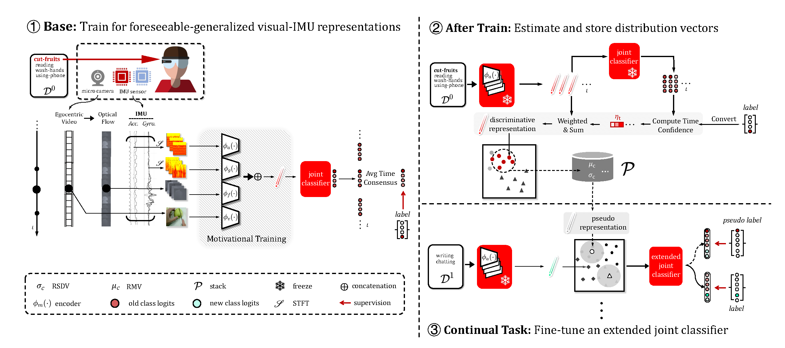
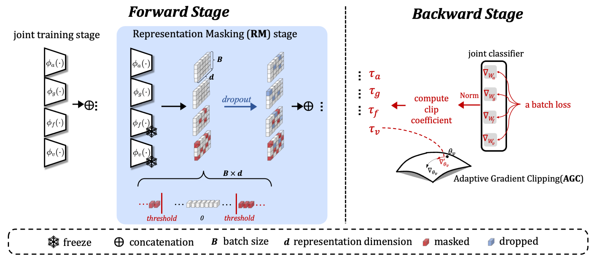

# Continual Egocentric Activity Recognition With Foreseeable-Generalized Visual–IMU Representations (IEEE Sensors Journal 2024)






Use this repo to reproduce the results of our methods FGVIR. Our published article can be found from: https://ieeexplore.ieee.org/abstract/document/10462907


## Reproduce Our Results
### Dataset and environment
Prepare original UESTC-MMEA-CL dataset can be following https://github.com/Xu-Linfeng/UESTC_MMEA_CL_main, which contains synchronous RGB, acceleration sequences, and gyroscope sequences.
The whole dataset can be download from: https://ivipclab.github.io/publication_uestc-mmea-cl/mmea-cl/. Our processed data (optical flow , acc STFT, and gyro STFT) will be available soon.

Follow our previous work https://github.com/Xu-Linfeng/UESTC_MMEA_CL_main to build the environment.

### Reproduce our method
```
sh train.sh
```
Contains continual task training and evaluation process.
Detail about training, model and modalities can be set in train.sh.

Continual task setting can be modified in exps/myewc.json

### Pretrained models

Follow the work of https://github.com/ekazakos/temporal-binding-network to prepare RGB and optical flow pretrained models.
We use the TBN-epic-kitchens-100.pth & TSN-kinetics-flow.pth.

## Acknowledgement
- PyCIL: [A awesome toolbox for Class Incremental Learning](https://github.com/G-U-N/PyCIL)
- Epic-Fusion(temporal-binding-network) : [Multimodal egocentric activity recognition implementation toolbox](https://github.com/ekazakos/temporal-binding-network)

## Citation
```
@ARTICLE{10462907,
  author={He, Chiyuan and Cheng, Shaoxu and Qiu, Zihuan and Xu, Linfeng and Meng, Fanman and Wu, Qingbo and Li, Hongliang},
  journal={IEEE Sensors Journal}, 
  title={Continual Egocentric Activity Recognition With Foreseeable-Generalized Visual–IMU Representations}, 
  year={2024},
  volume={24},
  number={8},
  pages={12934-12945},
  keywords={Task analysis;Sensors;Training;Human activity recognition;Wearable sensors;Videos;Optimization;Continual learning;human activity recognition (HAR);multimodal network;wearable sensors},
  doi={10.1109/JSEN.2024.3371975}}

```
